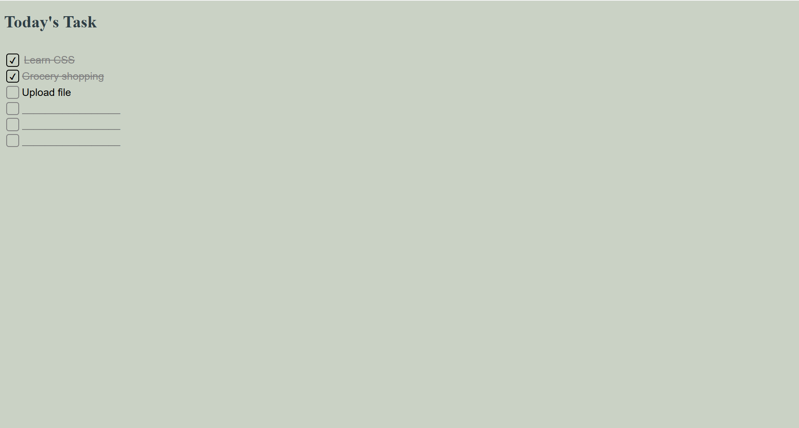

# My-To-Do-List-
It is a simple Task Mangaer built with HTML,CSS and JavaScript.
 
## Features
- Add and delete tasks
- Mark tasks as complete
- Data saved in localStorage
-  

## Built with
- HTML5
- CSS3
- Vanilla JavaScript
-  
## Getting started
1. Clone the repo
   git clone https://github.com/Lakshita00/My-To-Do-List.git
2. Open index.html in your browser
3.  
## Live demo
https://Lakshita00.github.io/My-To-Do-List
 
## What I learned
- How CSS flexbox affects layout
- How to use localStorage to persist data
- Handling DOM events in JavaScript
